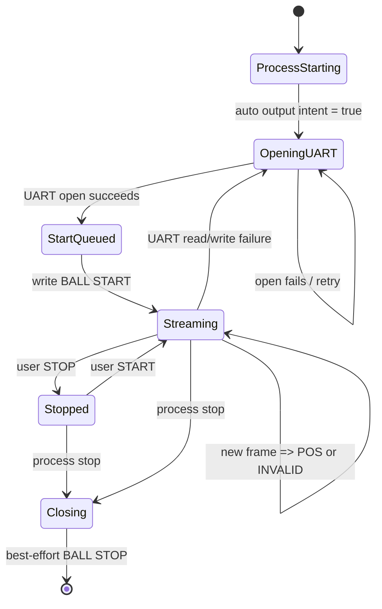

# UART 启动与重连序列

## 进程启动

1. `VisionRuntime` 初始化唯一 CameraService、NCNN detector 和 BallUartClient。
2. 启动配置 `startup.competition_mode: true` 在本进程启动时读取一次。
3. Runtime 先把输出意图设为运行并排队 START，再启动 UART 工作线程。
4. 网页后续主动 STOP 会保持停止；自动配置不会在循环中重新应用。

## 串口打开与 START

1. UART 以 `/dev/ttyAMA0`、9600、8N1、无流控打开。
2. 打开成功立即标记发送链路可用，不等待任何接收数据。
3. 清除断线期间保存的旧位置。
4. 若当前输出意图为运行，去重 START/STOP 控制项并高优先级插入一个 START。
5. 每个新连接最多发送一次 START；READY、OK、ERR、STATUS 都不会额外排队 START。

## POS 与 INVALID

- 有效钢球毫米位置：`BALL POS <十进制整数>\r\n`。
- 取值范围仍由既有编码器限制为 `-125..125`。
- 无效识别、映射失败或端点丢失：`BALL INVALID\r\n`。
- latest-only 槽位使新结果覆盖未发送旧结果；发送上限仍由 `send_rate_hz` 控制。
- MCU 不回复时线程仍读取空数据并继续发送新视觉结果，不伪造旧位置补足 50 Hz。

## 重连

1. 读写异常关闭当前串口句柄。
2. 等待现有 `reconnect_interval_s`。
3. 打开新的串口连接。
4. 丢弃断线期间的旧位置。
5. 若输出意图仍为运行，发送一个新的 START。
6. 只发送重连后到达的最新视觉结果。

## STOP

- 网页主动停止：清除 pending 位置、高优先级发送 STOP，并停止 POS/INVALID。
- SIGINT、SIGTERM、systemd stop 或正常关闭：`close()` 尽最大努力排队并等待一次 STOP 写出，然后关闭句柄。

## 状态图

## 无 PING、无 READY 等待证明

- 生产 `_run()` 中没有 PING 计时器、`send_ping()` 调用或 READY gate。
- `_next_outbound()` 只检查用户输出意图、latest-only 数据和发送频率，不检查 MCU READY。
- READY/OK/ERR/STATUS 解析只更新诊断计数、日志和展示状态，不排队控制命令，也不撤销发送许可。
- 完整静默 MCU 自动化序列测试直接断言原始写入列表，不包含 PING。
